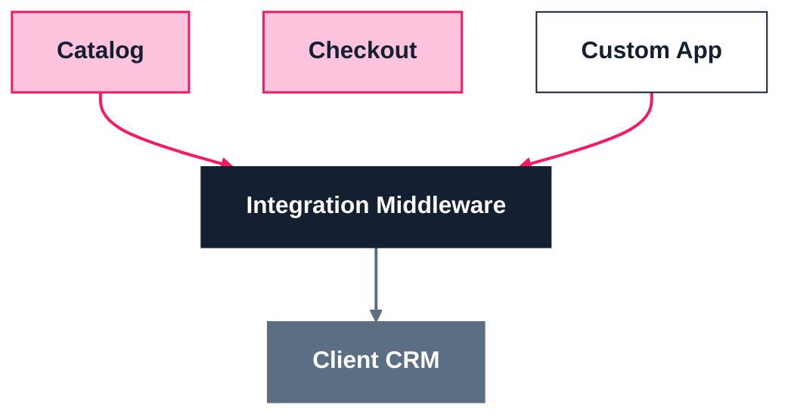

# VTEX Architecture & Solution Diagram Standard

Scope: solution architecture diagrams, integration diagrams, system/data-flow diagrams, C4-style diagrams — any box-and-arrow technical diagram produced for a client, proposal, or internal deck.

This is a **third system**, distinct from both the marketing brand palette and the Admin product tokens (see the "Two distinct systems" note in `SKILL.md`). Architecture diagrams are technical artifacts read at a distance or at small size, so **bold labels and uppercase sub-titles are allowed here even though the marketing typography rules (`references/typography.md`) prohibit them for headlines.** Colors always come from the brand palette (`references/colors.md`) — never invent new hex values for a diagram.

---

## Component → Style Mapping

Every box in a VTEX architecture diagram must be classified into exactly one of these four categories. This mapping is what makes a diagram "on-brand" — apply it every time, regardless of the specific solution being diagrammed.

| Category | Fill | Border | Text | Meaning |
|---|---|---|---|---|
| **VTEX native (OOTB)** | Bubble Gum Pink `#FFC4DD` | Rebel Pink `#F71963`, 1.5–2px | Serious Black `#142032`, bold | Standard VTEX module used as-is (Catalog, Checkout, OMS, Search, Pricing...) |
| **Custom app / VTEX IO** | White `#FFFFFF` | Serious Black `#142032`, 1–1.5px solid | Serious Black `#142032`, bold | Custom-built app, VTEX IO extension, or bespoke integration layer running on VTEX |
| **Non-VTEX / external** | Serious Gray `#5B6E84` | none or Serious Black 1px | White `#FFFFFF`, bold | Third-party system, client's legacy stack, external SaaS, non-VTEX channel |
| **Middleware / integration layer** | Serious Black `#142032` | none | White `#FFFFFF`, bold (+ regular-weight subtext) | The single integration seam between VTEX and external systems — render as a full-width banner, not a small box |

Grouping containers (the outer box that clusters related nodes, e.g. "Marketplace Account" or "Merchant Channels") follow a lighter version of the same rule: **white fill, colored border matching the category of what's inside** (pink border for a VTEX-side grouping, black/gray border for an external-systems grouping). The container's label sits in the same color as its border, positioned above-left, overlapping the top edge — never centered inside.

Sub-groupings that represent a process or optional flow inside a larger container (e.g. an entry pipeline, a matching step) use a **dashed Rebel Pink border with a Soft Blue `#F5F9FF` fill** to visually separate "flow" from "static module."

---

## Connectors

| Flow | Style |
|---|---|
| Between VTEX-native components | Solid Rebel Pink arrow |
| Between VTEX and an external/non-VTEX system | Solid Serious Gray or Serious Black arrow |
| Bidirectional sync (e.g., seller catalog sync) | Dashed Rebel Pink, double-headed, gray label caption |
| Any arrow needing a caption | Small Serious Gray label, positioned at the arrow midpoint, never overlapping the line |

---

## Required Elements — Checklist

Every diagram must include:

- [ ] **Title lockup, top-left:** "VTEX" in bold Rebel Pink, plus the solution/diagram name in bold Serious Gray or Serious Black, uppercase, immediately to the right on the same baseline
- [ ] **Legend, bottom-left:** one swatch + label per category actually used in the diagram ("VTEX nativo (OOTB)", "App custom / VTEX IO", "No-VTEX / externo", "Middleware de integración") — never omit, even for simple diagrams
- [ ] **Note/callout box** (optional, only if there's a non-obvious constraint worth flagging): white fill, thin Rebel Pink rounded border, bold pink "Note:" prefix, Serious Gray body text
- [ ] Even-column grid inside each grouping container, generous padding, rounded corners (~8–12px) on every box
- [ ] The VTEX logo is **not** required inside the diagram itself (the text lockup replaces it) — but do include the appropriate logo file if the diagram is placed on a slide or document cover

---

## HTML/CSS Template

Self-contained starter — copy this block, then add/remove `.node` elements and containers per the specific solution. Renders directly as an HTML artifact or can be screenshotted to PNG for a deck.

```html
<style>
  .vtex-diagram {
    font-family: 'VTEX Trust', system-ui, -apple-system, sans-serif;
    background: #FFFFFF;
    color: #142032;
    padding: 32px;
  }
  .diagram-title { display: flex; align-items: baseline; gap: 12px; margin-bottom: 24px; }
  .diagram-title .brand { color: #F71963; font-weight: 700; font-size: 28px; }
  .diagram-title .subtitle { color: #5B6E84; font-weight: 700; font-size: 16px; letter-spacing: 0.02em; text-transform: uppercase; }

  .group { position: relative; border: 2.5px solid #F71963; border-radius: 12px; padding: 24px 16px 16px; margin: 32px 0 12px; }
  .group.external { border-color: #142032; }
  .group-label { position: absolute; top: -14px; left: 16px; background: #FFFFFF; padding: 0 8px; font-weight: 700; color: #F71963; }
  .group.external .group-label { color: #142032; }
  .group-grid { display: grid; grid-template-columns: repeat(auto-fit, minmax(160px, 1fr)); gap: 10px; }

  .node { border-radius: 8px; padding: 14px 12px; text-align: center; font-weight: 700; }
  .node .sublabel { display: block; font-weight: 400; font-size: 12px; margin-top: 2px; opacity: 0.85; }

  .node.native   { background: #FFC4DD; border: 1.5px solid #F71963; color: #142032; }
  .node.custom   { background: #FFFFFF; border: 1px solid #142032; color: #142032; }
  .node.external { background: #5B6E84; color: #FFFFFF; }
  .node.middleware { background: #142032; color: #FFFFFF; grid-column: 1 / -1; padding: 18px; }

  .subgroup.dashed { border: 2px dashed #F71963; background: #F5F9FF; border-radius: 8px; padding: 12px; grid-column: 1 / -1; }

  .note-box { border: 1.5px solid #F71963; border-radius: 8px; padding: 10px 16px; margin-top: 24px; font-size: 13px; color: #5B6E84; }
  .note-box b { color: #F71963; }

  .legend { display: flex; gap: 20px; margin-top: 16px; font-size: 12px; color: #5B6E84; align-items: center; flex-wrap: wrap; }
  .legend .swatch { display: inline-block; width: 14px; height: 14px; border-radius: 3px; margin-right: 6px; vertical-align: middle; }
</style>

<div class="vtex-diagram">
  <div class="diagram-title">
    <span class="brand">VTEX</span>
    <span class="subtitle">Solution Architecture — [Client / Project Name]</span>
  </div>

  <div class="group">
    <div class="group-label">VTEX Marketplace Account</div>
    <div class="group-grid">
      <div class="node native">Catalog</div>
      <div class="node native">Checkout</div>
      <div class="node native">OMS</div>
      <div class="node custom">Custom App<span class="sublabel">VTEX IO</span></div>
    </div>
  </div>

  <div class="node middleware">Integration Middleware<span class="sublabel">Single integration path to client systems</span></div>

  <div class="group external">
    <div class="group-label">Client / External Systems</div>
    <div class="group-grid">
      <div class="node external">CRM</div>
      <div class="node external">ERP</div>
    </div>
  </div>

  <div class="note-box"><b>Note:</b> [call out any non-obvious constraint, e.g. "External systems only reachable through the middleware — no direct integration."]</div>

  <div class="legend">
    <span><span class="swatch" style="background:#FFC4DD;border:1.5px solid #F71963"></span>VTEX native (OOTB)</span>
    <span><span class="swatch" style="background:#FFFFFF;border:1px solid #142032"></span>Custom app / VTEX IO</span>
    <span><span class="swatch" style="background:#5B6E84"></span>Non-VTEX / external</span>
    <span><span class="swatch" style="background:#142032"></span>Middleware / integration</span>
  </div>
</div>
```

Arrows between containers aren't expressible in pure CSS flow layout — overlay an absolutely-positioned `<svg>` on top of `.vtex-diagram` (`position: relative` on the parent) with a `<marker>` arrowhead, stroke `#F71963` for VTEX-internal flows and `#5B6E84` for external flows:

```html
<svg style="position:absolute; overflow:visible;" width="2" height="40">
  <defs>
    <marker id="arrow-pink" viewBox="0 0 10 10" refX="5" refY="5" markerWidth="6" markerHeight="6" orient="auto-start-reverse">
      <path d="M0,0 L10,5 L0,10 z" fill="#F71963"/>
    </marker>
  </defs>
  <line x1="1" y1="0" x2="1" y2="34" stroke="#F71963" stroke-width="2" marker-end="url(#arrow-pink)"/>
</svg>
```

---

## Mermaid Quick Pattern

For fast diagrams inside markdown/chat (no image rendering needed). Mermaid's auto-layout won't match the precise grid above, but the color system carries over via `classDef`:



---

## Common Mistakes to Avoid

| Wrong | Correct |
|---|---|
| Inventing new colors for a "5th category" (e.g., blue for a data layer) | Reuse the 4-category mapping; if something doesn't fit, it's either custom (white/black) or external (gray) |
| Using Action Blue `#134CD8` from the product-UI tokens | Architecture diagrams use the brand palette only — Action Blue is Admin-UI-only, see `references/product-ui-tokens.md` |
| Omitting the legend because "it's obvious" | Always include it — it's what makes the diagram self-explanatory to someone outside the room |
| Centering the group label inside the container | Label overlaps the top-left border, like a fieldset legend |
| Rebel Pink used for both VTEX-native fill and external-system fill | Pink is reserved for VTEX; external systems are always Serious Gray or darker |
| Middleware rendered as a small box among others | Middleware is a full-width banner — it represents "everything crosses through here" |
